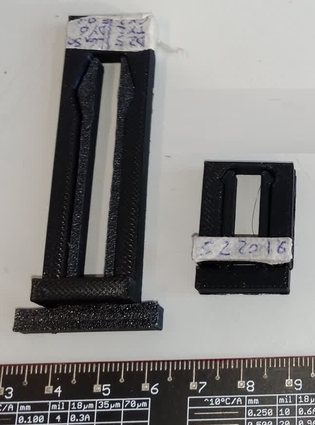

Experiment with just the female and male clips to found out dimensions and tollerances for mating

Geometry:
- D = distance between arms
- G = size of the grip bump
- L = Length of the arms
- H = Depth of the arms

Increasing cross section of the arms increase rigidity

Increasing length decrease rigidity

Increasing gap increases the insertion force

Increasing gap also increase retention force

The distance between arms should accomodate the gaps when the arm flex inside

Feedback:
- Male clips should always be printed flat, they break otherwise
- PLA is a lot more flexible than it seems. a 2mm by 2mm section by 10mm in length is a good benchmark for clip mating.
- Problem with flexing the clips outward once they are inserted fully

