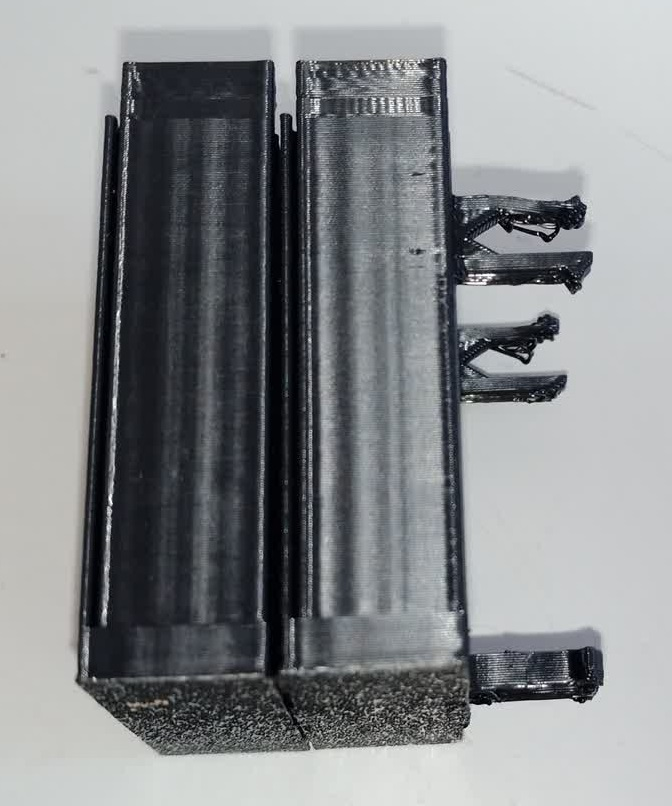

I want to make Servo Holder stackable, to practice with joining 3D Parts

I use the triangle male and female clips and add them to the model, so they daisy chain together

Feedback:
- It's very hard to add protuding male clips, the proper way to do it requires a 45° slant upward to avoid support, but make the clip very big
- Even with support, small protuding male clips are difficult to manufacture

IDEA:
- I can make female slots on the part, and 3D print double pronged male clips

