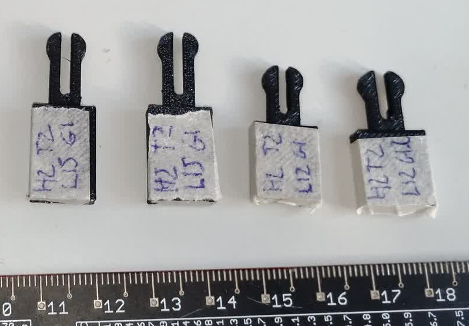

Experimenting with double male clips and female

The slicer has an hard time making the hard corners of a triangle clip, moving to a rounded clip

Now the female holder has a wedge to separate the arms when inserting, improves holding retention

Adjusting tollerances and strength

Feedback:
- Mating is very good, double male clips are easy to produce as standalone parts and have excellent retention